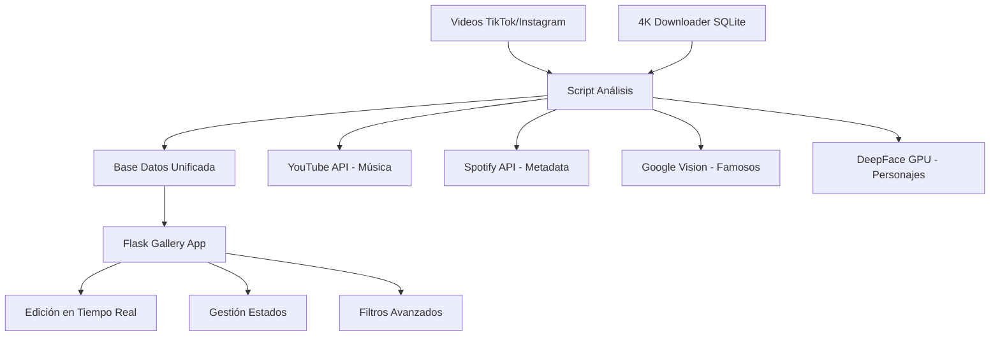

# 🎬 Tag-Flow V2: Sistema de Gestión de Videos TikTok/MMD

**Plan de Construcción Detallado - Sin Retrocompatibilidad**  
**Objetivo**: Sistema para catalogar y gestionar videos de TikTok trends y MMDs de videojuegos  
**Stack**: Python 3.12 + Flask + SQLite + APIs Gratuitas + GPU Local

---

## 🎯 Arquitectura Final



## 📊 Stack Tecnológico Definitivo

### Backend
- **Python 3.12**
- **Flask** + Jinja2 templates
- **SQLite** (base unificada)
- **OpenCV** + **MoviePy** (procesamiento video)

### APIs Reconocimiento
- **YouTube Data API v3** (gratis 10k/día) - Música trends
- **Spotify Web API** (gratis) - Metadata musical
- **Google Vision API** ($1.50/1000) - TikTokers famosos
- **DeepFace** (local GPU) - Personajes anime/gaming

### Frontend
- **Bootstrap 5** + **CSS Grid** (galería responsiva)
- **JavaScript vanilla** (interactividad)
- **Font Awesome** (iconos)
- **Lightbox** (preview videos)

### Herramientas
- **python-dotenv** (configuración)
- **requests** (APIs)
- **Pillow** (thumbnails)
- **pathlib** (rutas)

---

## 🗄️ Diseño de Base de Datos

### Tabla Principal: `videos`
```sql
CREATE TABLE videos (
    id INTEGER PRIMARY KEY AUTOINCREMENT,
    created_at TIMESTAMP DEFAULT CURRENT_TIMESTAMP,
    
    -- Archivos
    file_path TEXT NOT NULL UNIQUE,
    file_name TEXT NOT NULL,
    thumbnail_path TEXT,
    file_size INTEGER,
    duration_seconds INTEGER,
    
    -- Creador (desde 4K Downloader + manual)
    creator_name TEXT NOT NULL,
    platform TEXT DEFAULT 'tiktok', -- 'tiktok', 'instagram', 'youtube'
    
    -- Reconocimiento Automático
    detected_music TEXT,
    detected_music_artist TEXT,
    detected_music_confidence REAL,
    detected_characters TEXT, -- JSON array
    music_source TEXT, -- 'youtube', 'spotify', 'manual'
    
    -- Edición Manual (Frontend)
    final_music TEXT,
    final_music_artist TEXT,
    final_characters TEXT, -- JSON array
    difficulty_level TEXT CHECK(difficulty_level IN ('bajo', 'medio', 'alto')),
    
    -- Estados del Proyecto
    edit_status TEXT DEFAULT 'nulo' CHECK(edit_status IN ('nulo', 'en_proceso', 'hecho')),
    edited_video_path TEXT,
    notes TEXT,
    
    -- Metadatos
    processing_status TEXT DEFAULT 'pendiente' CHECK(processing_status IN ('pendiente', 'procesando', 'completado', 'error')),
    error_message TEXT,
    last_updated TIMESTAMP DEFAULT CURRENT_TIMESTAMP
);
```

### Tabla de Integración: `downloader_mapping`
```sql
CREATE TABLE downloader_mapping (
    video_id INTEGER,
    download_item_id INTEGER,
    original_filename TEXT,
    creator_from_downloader TEXT,
    FOREIGN KEY (video_id) REFERENCES videos(id)
);
```

---

## 📁 Estructura del Proyecto

```
Tag-Flow-V2/
├── .env                          # APIs keys
├── requirements.txt              # Dependencias
├── config.py                     # Configuración central
├── main.py                       # Script análisis principal
├── app.py                        # Flask application
│
├── src/
│   ├── __init__.py
│   ├── database.py               # Gestión SQLite
│   ├── video_processor.py        # Procesamiento videos
│   ├── music_recognition.py      # YouTube + Spotify APIs
│   ├── face_recognition.py       # Google Vision + DeepFace
│   ├── downloader_integration.py # Integración 4K Downloader
│   └── thumbnail_generator.py    # Generación thumbnails
│
├── templates/
│   ├── base.html                 # Template base
│   ├── gallery.html              # Galería principal
│   ├── edit_video.html           # Editor individual
│   └── components/
│       ├── video_card.html       # Card de video
│       ├── filters.html          # Barra filtros
│       └── modals.html           # Modales edición
│
├── static/
│   ├── css/
│   │   ├── main.css              # Estilos principales
│   │   └── gallery.css           # Estilos galería
│   ├── js/
│   │   ├── main.js               # JavaScript principal
│   │   ├── gallery.js            # Funciones galería
│   │   └── editor.js             # Editor en línea
│   └── icons/                    # Iconos personalizados
│
├── data/
│   ├── videos.db                 # Base datos principal
│   ├── thumbnails/               # Thumbnails generados
│   └── deepface_models/          # Modelos DeepFace
│
├── caras_conocidas/              # Fotos referencia personajes
│   ├── genshin/
│   │   ├── zhongli.jpg
│   │   └── raiden.jpg
│   └── honkai/
│       ├── firefly.jpg
│       └── blade.jpg
│
└── videos_procesados/            # Videos organizados
    ├── tiktoker_1/
    ├── tiktoker_2/
    └── ...
```

---

## 🔧 Configuración Inicial

### 1. Archivo `.env`
```env
# YouTube Data API
YOUTUBE_API_KEY="tu_clave_youtube_aqui"

# Google Vision API  
GOOGLE_APPLICATION_CREDENTIALS="config/gcp_credentials.json"

# Spotify API
SPOTIFY_CLIENT_ID="tu_spotify_client_id"
SPOTIFY_CLIENT_SECRET="tu_spotify_client_secret"

# 4K Video Downloader Integration
DOWNLOADER_DB_PATH="C:/Users/loler/AppData/Local/4kdownload.com/4K Video Downloader+/4K Video Downloader+/faefbcd1-76a6-4fbc-b730-724f2735eee4.sqlite"

# Configuración Procesamiento
THUMBNAIL_SIZE="320x180"
MAX_CONCURRENT_PROCESSING=3
USE_GPU_DEEPFACE=true
DEEPFACE_MODEL="ArcFace"  # O "Facenet", "VGG-Face"
```

### 2. `requirements.txt`
```txt
# Core Framework
Flask==3.0.0
Jinja2==3.1.2

# Database
sqlite3

# Video Processing
opencv-python==4.8.1
moviepy==1.0.3
Pillow==10.1.0

# AI/ML Recognition
deepface==0.0.79
google-cloud-vision==3.5.0
insightface==0.7.3

# API Clients
google-api-python-client==2.108.0
spotipy==2.23.0
requests==2.31.0

# Utilities
python-dotenv==1.0.0
pathlib
tqdm==4.66.1
python-magic==0.4.27

# Optional GPU acceleration
torch==2.1.0+cu118
torchvision==0.16.0+cu118
```

---

## 🚀 Plan de Desarrollo (2-3 Semanas)

### **Semana 1: Backend Core**

#### Día 1-2: Configuración Base
```bash
# Crear proyecto
mkdir Tag-Flow-V2 && cd Tag-Flow-V2
python -m venv tag-flow-env
tag-flow-env\Scripts\activate

# Instalar dependencias
pip install -r requirements.txt

# Configurar APIs
# - Crear proyecto Google Cloud
# - Habilitar Vision API y YouTube Data API
# - Crear app Spotify
# - Configurar .env
```

#### Día 3-4: Base de Datos y Integración
```python
# src/database.py
def setup_database():
    """Crear tablas y migrar datos de 4K Downloader"""
    
# src/downloader_integration.py  
def import_from_4k_downloader():
    """Importar creators y rutas desde SQLite existente"""
```

#### Día 5-7: Reconocimiento Core
```python
# src/music_recognition.py
def recognize_music_hybrid(audio_path):
    """YouTube API -> Spotify API -> Manual fallback"""

# src/face_recognition.py
def recognize_faces_hybrid(image_path):
    """Google Vision -> DeepFace GPU -> Manual fallback"""
```

### **Semana 2: Procesamiento y Frontend Base**

#### Día 8-10: Script Principal
```python
# main.py - Script de procesamiento
def process_new_videos():
    """
    1. Escanear carpetas nuevas
    2. Generar thumbnails
    3. Reconocimiento música/caras
    4. Guardar en BD
    """
```

#### Día 11-14: Flask Application Core
```python
# app.py
@app.route('/')
def gallery():
    """Galería principal con filtros"""

@app.route('/edit/<int:video_id>')
def edit_video():
    """Editor individual"""

@app.route('/api/update_video', methods=['POST'])
def update_video():
    """API para ediciones en tiempo real"""
```

### **Semana 3: Frontend Avanzado y Pulido**

#### Día 15-17: Galería Visual
```html
<!-- templates/gallery.html -->
<div class="video-grid">
    
    <div class="video-card" data-creator="{{ video.creator }}" 
         data-music="{{ video.music }}" data-difficulty="{{ video.difficulty }}">
        <div class="thumbnail-container">
            
            <div class="overlay">
                <button class="btn-play" data-video="{{ video.file_path }}">▶</button>
                <button class="btn-edit" data-id="{{ video.id }}">✏️</button>
                <button class="btn-folder" data-path="{{ video.file_path }}">📁</button>
            </div>
        </div>
        <div class="video-info">
            <h5>{{ video.creator }}</h5>
            <p>🎵 {{ video.music or 'Sin música' }}</p>
            <p>🎭 {{ video.characters or 'Sin personajes' }}</p>
            <span class="difficulty-badge difficulty-{{ video.difficulty }}">
                {{ video.difficulty or 'Sin dificultad' }}
            </span>
            <span class="status-badge status-{{ video.edit_status }}">
                {{ video.edit_status }}
            </span>
        </div>
    </div>
    
</div>
```

#### Día 18-19: Sistema de Edición
```javascript
// static/js/editor.js
function updateVideoField(videoId, field, value) {
    fetch('/api/update_video', {
        method: 'POST',
        headers: {'Content-Type': 'application/json'},
        body: JSON.stringify({
            id: videoId,
            field: field,
            value: value
        })
    }).then(response => response.json())
      .then(data => updateUI(data));
}

function openVideoFolder(videoPath) {
    // Abrir carpeta del video
    fetch('/api/open_folder', {
        method: 'POST',
        body: JSON.stringify({path: videoPath})
    });
}
```

#### Día 20-21: Filtros y Optimización
```javascript
// static/js/gallery.js
function applyFilters() {
    const filters = {
        creator: document.getElementById('filter-creator').value,
        music: document.getElementById('filter-music').value,
        characters: document.getElementById('filter-characters').value,
        difficulty: document.getElementById('filter-difficulty').value,
        status: document.getElementById('filter-status').value
    };
    
    filterVideos(filters);
}

function filterVideos(filters) {
    // Filtrado en tiempo real sin recargar página
    document.querySelectorAll('.video-card').forEach(card => {
        const show = Object.entries(filters).every(([key, value]) => {
            if (!value) return true;
            return card.dataset[key]?.includes(value);
        });
        card.style.display = show ? 'block' : 'none';
    });
}
```

---

## 🎨 Características del Frontend

### Galería Visual
- **Grid responsivo**: 4 columnas desktop → 2 tablet → 1 móvil
- **Thumbnails automáticos**: Generados al procesar
- **Hover effects**: Preview y botones de acción
- **Infinite scroll**: Carga progresiva
- **Lightbox**: Reproductor modal

### Sistema de Edición
- **Edición inline**: Click para editar campos
- **Autocomplete**: Sugerencias basadas en historial
- **Validación**: Tiempo real con feedback visual
- **Guardado automático**: Sin necesidad de "Guardar"
- **Historial**: Deshacer/rehacer cambios

### Filtros Avanzados
```html
<div class="filters-panel">
    <select id="filter-creator" multiple>
        <option value="">Todos los creadores</option>
        <!-- Poblado dinámicamente -->
    </select>
    
    <input id="filter-music" placeholder="Buscar música...">
    
    <select id="filter-characters" multiple>
        <option value="">Todos los personajes</option>
    </select>
    
    <select id="filter-difficulty">
        <option value="">Cualquier dificultad</option>
        <option value="bajo">Bajo</option>
        <option value="medio">Medio</option>
        <option value="alto">Alto</option>
    </select>
    
    <select id="filter-status">
        <option value="">Cualquier estado</option>
        <option value="nulo">Sin procesar</option>
        <option value="en_proceso">En proceso</option>
        <option value="hecho">Completado</option>
    </select>
</div>
```

---

## 🔧 Funcionalidades Específicas

### 1. Gestión Estados de Edición
```python
@app.route('/api/update_status', methods=['POST'])
def update_edit_status():
    data = request.json
    video_id = data['id']
    new_status = data['status']
    edited_path = data.get('edited_path')
    
    # Actualizar BD
    cursor.execute("""
        UPDATE videos 
        SET edit_status = ?, edited_video_path = ?, last_updated = CURRENT_TIMESTAMP
        WHERE id = ?
    """, (new_status, edited_path, video_id))
    
    return jsonify({'success': True})
```

### 2. Abrir Carpeta desde Frontend
```python
@app.route('/api/open_folder', methods=['POST'])
def open_video_folder():
    data = request.json
    video_path = data['path']
    folder_path = os.path.dirname(video_path)
    
    # Abrir explorador de archivos
    if os.name == 'nt':  # Windows
        os.startfile(folder_path)
    elif os.name == 'posix':  # macOS/Linux
        subprocess.call(['open', folder_path])
    
    return jsonify({'success': True})
```

### 3. Búsqueda Inteligente
```javascript
function intelligentSearch(query) {
    // Buscar en múltiples campos
    const searchFields = ['creator', 'music', 'characters', 'notes'];
    const results = videos.filter(video => 
        searchFields.some(field => 
            video[field]?.toLowerCase().includes(query.toLowerCase())
        )
    );
    return results;
}
```

---

## 📊 Costos Estimados

### APIs (200 videos/mes)
- **YouTube API**: GRATIS (10k consultas/día)
- **Spotify API**: GRATIS (rate limits generosos)
- **Google Vision**: ~$3-5/mes (1000-2000 detecciones)
- **Total**: **$3-5/mes**

### Hardware Local
- **DeepFace GPU**: GRATIS (tu GPU)
- **SQLite**: GRATIS
- **Flask**: GRATIS
- **Total**: **$0**

### **TOTAL MENSUAL: $3-5** ✅

---

## 🚀 Comandos de Ejecución

### Desarrollo
```bash
# Activar entorno
tag-flow-env\Scripts\activate

# Procesar videos nuevos
python main.py

# Lanzar aplicación web
python app.py
# → http://localhost:5000
```

### Producción
```bash
# Usar Gunicorn (opcional)
pip install gunicorn
gunicorn -w 4 -b 0.0.0.0:5000 app:app
```

---

## 🎯 Optimizaciones para TikTok/MMD

### Reconocimiento Musical Especializado
```python
def recognize_tiktok_trends(audio_path):
    """Optimizado para música viral de TikTok"""
    
    # 1. YouTube API con keywords TikTok
    yt_result = youtube_search(audio_path, keywords=['tiktok', 'trend', 'viral'])
    
    # 2. Spotify con playlists populares
    spotify_result = spotify_search(audio_path, playlists=['viral50', 'tiktok'])
    
    return merge_results(yt_result, spotify_result)
```

### Base Personajes Gaming/Anime
```python
# caras_conocidas/ - Estructura optimizada
genshin_impact/
├── zhongli.jpg
├── raiden_shogun.jpg
├── hu_tao.jpg
└── ...

honkai_star_rail/
├── firefly.jpg
├── blade.jpg
├── kafka.jpg
└── ...

anime_popular/
├── nezuko.jpg
├── zenitsu.jpg
└── ...
```

---

## ✅ Checklist de Implementación

### Semana 1
- [ ] Configurar entorno Python 3.12
- [ ] Configurar APIs (YouTube, Spotify, Google Vision)
- [ ] Crear base de datos SQLite unificada
- [ ] Integrar con 4K Video Downloader
- [ ] Implementar reconocimiento música híbrido
- [ ] Implementar reconocimiento facial híbrido
- [ ] Testear pipeline completo con 5-10 videos

### Semana 2
- [ ] Crear script procesamiento principal
- [ ] Implementar generación thumbnails
- [ ] Crear Flask app básica
- [ ] Implementar rutas principales
- [ ] Crear templates base
- [ ] Implementar API endpoints

### Semana 3
- [ ] Diseñar galería responsiva
- [ ] Implementar sistema edición inline
- [ ] Crear filtros avanzados
- [ ] Implementar gestión estados
- [ ] Añadir funcionalidad abrir carpetas
- [ ] Optimizar rendimiento
- [ ] Testing final y documentación

---

**¡Con este plan tienes un sistema completo optimizado para tu caso de uso específico de TikTok/MMDs! Flask manejará perfectamente todas las funcionalidades de edición que necesitas sin la complejidad de React.**